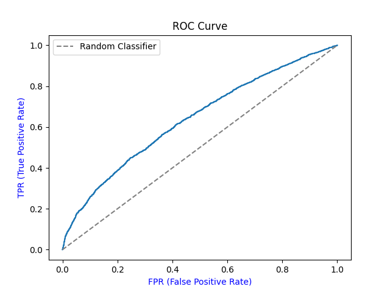
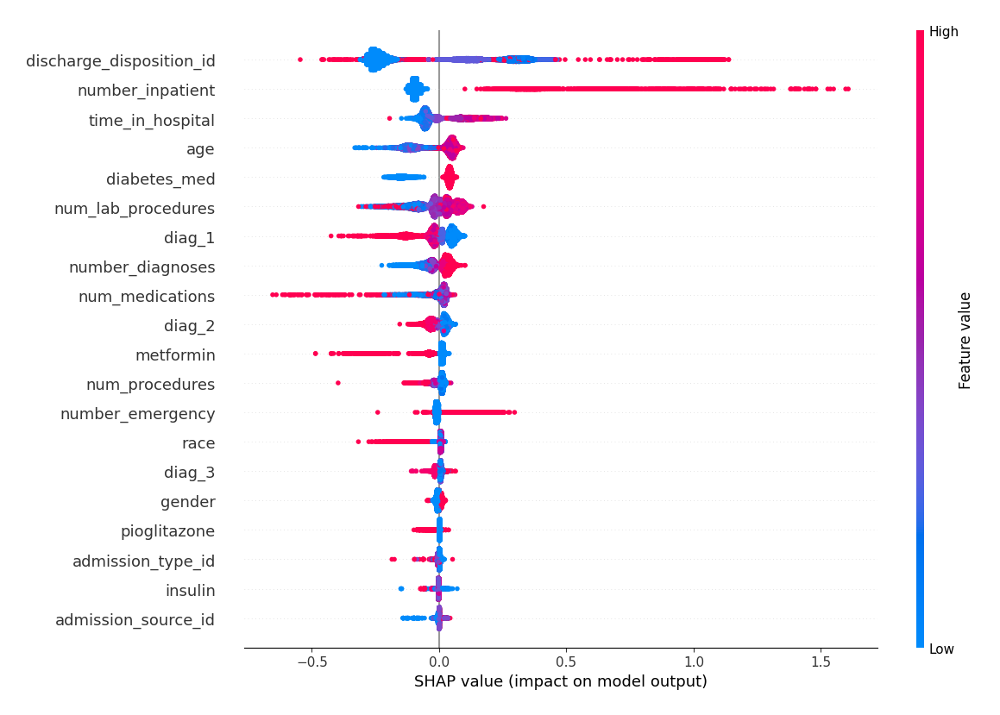

## Hospital Readmission Prediction

This ML system predicts the risk of hospital readmission for diabetic patients within 30 days of discharge.

Reducing early readmissions is critical for hospitals as it reflects:
  - Improved Healthcare Quality
  - Patient Safety
  - Cost Reduction

Built with:
  - **XGBoost**
  - **SHAP explainability**
  - **FastAPI REST API**
  - **PostgreSQL**
  - **Gemini LLM-powered clinical summaries**
  - **Containerized with Docker**
  - **Deployed on Railway**


## Live Demo

The API is deployed and publicly accessible at:
[Live API](https://hospital-readmission-prediction-production.up.railway.app/docs)

Try the `/predict` endpoint with the sample payloads 
in the `examples/` folder.


## Features

- The ML model outputs the predicted probability of readmission and the predicted class (0: No readmission, 1: Readmission in <30 days) using XGBoost.
- SHAP explainability identifies the key clinical factors driving each prediction, enabling transparent decision-making.
- The Gemini LLM translates model predictions into human-readable explanations.
- PostgreSQL logging of all predictions with raw input data for model performance monitoring.
- RESTful API built with FastAPI, providing a /predict endpoint for real-time inference.
- Dockerized application with docker-compose for reproducible deployment across any computer environment.
- Deployed on Railway (PaaS) with a public endpoint accessible to any user.

## Tech Stack

| Category | Technology |
|---|---|
| ML MODEL | XGBoost, RandomizedSearchCV, Scikit-learn |
| Explainability | SHAP |
| API | FastAPI, Pydantic |
| Database | PostgreSQL |
| LLM | Google Gemini |
| Containerization | Docker, docker-compose |
| Deployment | Railway (PaaS) |
| Language | Python |


## Model Performance

| Metric | Value |
|---|---|
| AUC | 0.6371 |
| Accuracy | 63.5% |
| Precision | 13.36% |
| Recall | 55.44% |
| F1-Score | 0.21 |

This dataset is a well-known challenging benchmark in healthcare ML. 
Published studies report AUC scores between 0.62–0.70 (Strack et al., 2014), 
consistent with the results above.





## API Usage

### Try it via Swagger UI

Visit the [Live API Docs](https://hospital-readmission-prediction-production.up.railway.app/docs) 
and use the `/predict` endpoint with the sample payloads 
in the `examples/` folder.

### Example Request (cURL)

```bash
curl -X POST "https://hospital-readmission-prediction-production.up.railway.app/predict" \
  -H "Content-Type: application/json" \
  -d @examples/high_risk_request.json
```

### Example Response

```json
{
  "predicted_probability": 0.80,
  "predicted_class": 1,
  "llm_summary": "Based on our prediction, this patient has an 80% chance of being readmitted
  to the hospital within 30 days. This high likelihood is driven by factors such as their
  advanced age, history of multiple past hospitalizations, and complex health issues,
  notably their main diagnosis of congestive heart failure."
}
```

## Run Locally

### Prerequisites

- [Git](https://git-scm.com/downloads)
- [Docker](https://docs.docker.com/get-docker/)


### Setup

**1. Clone the repository**
```bash
git clone https://github.com/IoannisKotsis/hospital-readmission-prediction
cd hospital-readmission-prediction
```

**2. Create a `.env` file in the root directory**
```
DB_HOST=localhost
DB_NAME=your_db_name
DB_USER=your_db_user
DB_PASSWORD=your_db_password
DB_PORT=5432
GOOGLE_API_KEY=your_gemini_api_key
```

**3. Run**
```bash
docker-compose up --build
```

**4. Access the API**
Open: http://localhost:8000/docs


## Project Structure

```
hospital-readmission-prediction
|-- examples/
        |-- high_risk_request.json   # Request with high risk patient data
        |-- low_risk_request.json   # Request with low risk patient data
|-- notebooks/
        |-- 01_exploration.ipynb   # Dataset exploration notebook
|-- src/
      |-- __init__.py   # Python package marker
      |-- database.py   # Insert predictions to PostgreSQL
      |-- explainability.py   # SHAP values calculation
      |-- llm.py   # Google Gemini API
      |-- main.py  # FastAPI application
      |-- model.py    # Training and testing (XGBoost)
      |-- preprocessing.py    # Data preprocessing
      |-- encoder.pkl   # Fitted OrdinalEncoder
      |-- model.pkl   # Saved model
      |-- roc_curve.png   # ROC curve plot
      |-- shap_values.png   # SHAP values plot
      |--index.html   # Live frontend UI
|-- .dockerignore   # Files excluded from Docker build
|-- .gitignore   # Files excluded from Git tracking
|-- docker-compose.yml   # Multi-container orchestration
|-- Dockerfile   # Container image definition   
|-- init.sql   # Database table structure
|-- requirements.txt   # Python dependencies
```


## Dataset


The Diabetes 130-US Hospitals dataset from the 
UCI Machine Learning Repository.

- **Source:** [UCI ML Repository](https://archive.ics.uci.edu/dataset/296/diabetes+130-us+hospitals+for+years+1999-2008)
- **Records:** ~100,000 hospital admissions
- **Period:** 1999–2008
- **Hospitals:** 130 US hospitals

**Citation:**
Strack, B., DeShazo, J.P., Gennings, C., Olmo, J.L., Ventura, S., 
Cios, K.J., & Clore, J.N. (2014). *Impact of HbA1c Measurement on 
Hospital Readmission Rates: Analysis of 70,000 Clinical Database 
Patient Records.* BioMed Research International, vol. 2014.